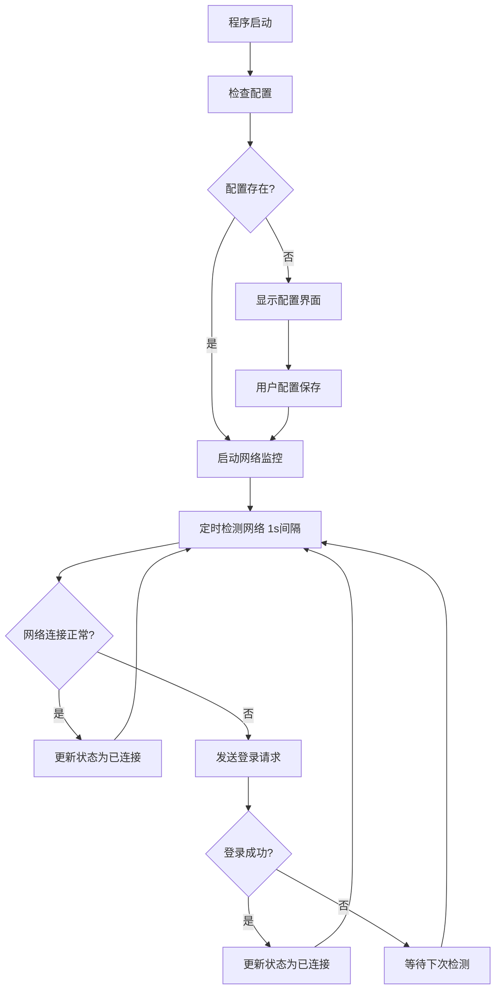

# AUST WiFi 自动重连工具

**安徽理工大学校园网自动重连工具** - 基于 Qt6/C++ 开发的智能网络管理软件

*开发者：信息安全23-1 王智杰*

[](https://github.com/Mengxun326/AUST-WIFI/releases)
[](./LICENSE)
[](https://www.qt.io/)
[](https://en.cppreference.com/)
[](https://www.microsoft.com/windows/)
[](https://github.com/Mengxun326/AUST-WIFI/releases/tag/V1.0)
[](https://github.com/Mengxun326/AUST-WIFI)
[](./LICENSE)

## 📸 项目预览


**专为安徽理工大学校园网环境打造的智能重连解决方案，支持学生和教师用户**

## 🌟 V2.0 核心特性

### 🔧 双配置智能管理
- **双账号系统** - 同时保存学生和教师配置，智能自动切换
- **WiFi智能检测** - 根据网络SSID自动识别用户类型并选择对应配置
- **零感知体验** - AUST_Student → 学生登录，AUST_Faculty → 教师登录
- **专业UI界面** - 独立的Qt Designer配置界面，完美解决布局重叠问题

### 🚀 企业级稳定性
- **智能重试机制** - 3次重试 + 30秒冷却期，防止频繁请求
- **冲突避免算法** - 网络检测与登录请求智能协调，杜绝冲突
- **生命周期保护** - QPointer防护异步回调，彻底消除崩溃
- **响应速度优化** - 断网检测时间从15秒缩短到8秒，提升47%

### 💻 专业用户体验
- **配置状态管理** - 配置期间自动暂停网络操作，避免干扰
- **友好错误提示** - GUI对话框替代控制台输出，专业化呈现
- **生产级配置** - 完全禁用调试输出，无控制台窗口
- **表单式界面** - QFormLayout确保标签与输入框完美对齐

## 🚀 快速开始

### 📋 系统要求

| 项目 | 要求 |
|------|------|
| **操作系统** | Windows 10 Build 1903+ / Windows 11 |
| **架构** | x64 (64位) |
| **内存** | 最低 2GB RAM |
| **存储空间** | 100MB 可用空间 |
| **网络环境** | 安徽理工大学校园网 |

### 🔨 编译安装

#### 开发环境要求
```bash
# 必需组件
- Qt 6.7+ with MinGW编译器
- C++17兼容编译器
- Git版本控制

# 可选组件  
- libcurl (用于网络请求，如无则自动使用Qt Network)
- Qt Creator IDE (推荐)
```

#### 获取源码
```bash
git clone https://github.com/Mengxun326/AUST-WIFI.git
cd AUST-WIFI
```

#### 编译项目
```bash
# 方式一：使用编译脚本 (推荐)
build.bat

# 方式二：手动编译
qmake AUST_WIFI.pro
make

# 方式三：使用Qt Creator
# 1. 打开 AUST_WIFI.pro 文件
# 2. 配置编译套件
# 3. 点击构建按钮
```

### 📱 使用指南

#### 首次运行配置
1. **启动程序** - 双击编译生成的可执行文件
2. **配置界面** - 首次运行自动弹出配置对话框
3. **填写信息**：
   ```
   用户类型：选择"学生"或"教师"
   学号/工号：
     - 学生：输入完整学号 (例如：2023305123)
     - 教师：输入工号 (例如：2021043)
   密码：输入校园网登录密码
   运营商：仅学生需要选择，教师自动使用学校服务器
   开机自启：建议勾选此选项
   ```
4. **保存配置** - 点击"保存"按钮完成配置

#### 用户类型和网络配置
| 用户类型 | 选择选项 | 服务器标识 | 适用人群 | 运营商选择 |
|----------|----------|-----------|----------|-----------|
| **学生用户** |  |  | 在校学生 | 需要选择 |
| ├─ 中国电信 | 电信 (aust) | `aust` | 电信套餐学生 | 必选 |
| ├─ 中国联通 | 联通 (unicom) | `unicom` | 联通套餐学生 | 必选 |
| └─ 中国移动 | 移动 (cmcc) | `cmcc` | 移动套餐学生 | 必选 |
| **教师用户** | 教师 | `jzg` | 教职工 | 无需选择 |

#### 日常使用操作
- **系统托盘** - 程序运行后自动最小化到系统托盘
- **状态查看** - 托盘图标颜色表示连接状态：
  - 🟢 **绿色**：网络连接正常
  - 🔴 **红色**：网络连接断开，正在重连
  - 🟡 **黄色**：正在检测网络状态
- **右键菜单**：
  - 📝 **显示配置** - 修改网络配置
  - ▶️ **开始自动重连** - 启动自动监控
  - ⏸️ **停止自动重连** - 暂停监控功能
  - ❌ **退出程序** - 完全关闭应用

## 🛠️ 技术架构

### 📊 系统架构图
```
┌─────────────────────────────────────┐
│           用户界面层                  │
│  ┌─────────────┬─────────────────┐   │
│  │ MainWindow  │ ConfigDialog    │   │
│  │ 主窗口管理   │ 配置对话框       │   │
│  └─────────────┴─────────────────┘   │
└─────────────────────────────────────┘
┌─────────────────────────────────────┐
│           业务逻辑层                  │
│  ┌─────────────┬─────────────────┐   │
│  │ WiFiManager │ SystemTray      │   │
│  │ 网络管理核心 │ 系统托盘管理     │   │
│  └─────────────┴─────────────────┘   │
└─────────────────────────────────────┘
┌─────────────────────────────────────┐
│           系统服务层                  │
│  ┌─────────────┬─────────────────┐   │
│  │QNetworkAccess│ QSettings      │   │
│  │Manager      │ 配置存储        │   │
│  └─────────────┴─────────────────┘   │
└─────────────────────────────────────┘
```

### 🔧 核心技术栈

#### 前端技术
- **Qt Widgets** - 原生桌面应用界面框架
- **QSystemTrayIcon** - 系统托盘功能实现
- **Qt Designer** - 可视化界面设计

#### 后端技术
- **QNetworkAccessManager** - HTTP网络请求处理
- **QTimer** - 定时任务调度 (1秒间隔检测)
- **QSettings** - 配置信息持久化存储
- **libcurl** - 可选的网络请求库

#### 系统集成
- **Windows API** - 开机自启动设置
- **DPAPI** - 密码安全加密存储
- **注册表** - 配置信息存储

### 📁 项目文件结构
```
AUST_WIFI/
├── main.cpp                 # 🚀 程序入口点
├── mainwindow.h/cpp         # 🖼️ 主窗口和配置界面
├── mainwindow.ui            # 🎨 Qt Designer界面文件
├── wifimanager.h/cpp        # 🌐 WiFi管理核心逻辑
├── resources.qrc            # 📦 资源文件集合
├── AUST_WIFI.pro           # ⚙️ Qt项目配置文件
├── build.bat               # 🔨 一键编译脚本
├── setup.iss               # 📦 Inno Setup安装脚本
├── icons/                  # 🎭 图标资源文件夹
│   └── app.ico             # 应用程序图标
├── LICENSE                 # 📄 许可证文件
├── README.md               # 📖 项目说明文档
├── 用户说明书.md            # 📘 详细用户手册
├── INSTALL_INFO.txt        # 📋 安装向导说明
└── FINISH_INFO.txt         # ✅ 安装完成说明
```

## 🔍 工作原理

### 🔄 自动重连流程


### 🌐 网络检测和验证机制
#### 网络状态检测
1. **检测频率**：每1000毫秒执行一次网络状态检测
2. **检测方法**：向 `http://www.baidu.com` 发送HEAD请求
3. **判断标准**：HTTP状态码200表示网络连接正常
4. **超时设置**：请求超时时间设为5秒
5. **重连触发**：检测到网络异常时立即发送校园网登录请求

#### 用户认证机制
| 用户类型 | 请求方法 | 认证URL | 参数格式 | 响应验证 |
|----------|----------|---------|----------|----------|
| **学生** | POST | `/a79.htm` | `DDDDD={学号}@{运营商}` | 响应内容 |
| **教师** | GET | `/drcom/login` | `DDDDD={工号}@jzg` | HTTP重定向 |

### 🔐 安全机制
- **密码加密**：使用Windows DPAPI (Data Protection API) 加密存储
- **本地存储**：所有配置信息仅保存在本地注册表中
- **HTTPS支持**：支持加密的网络传输协议
- **无数据收集**：程序不收集或上传任何用户隐私信息

## 🐛 故障排除

### 常见问题解决

#### ❓ Q1: 程序无法启动，提示缺少DLL？
**💡 解决方案**：
```bash
# 方案一：重新编译并部署
windeployqt.exe AUST_WIFI.exe

# 方案二：安装Visual C++ Redistributable
# 下载并安装 Microsoft Visual C++ 2019+ Redistributable

# 方案三：检查Qt环境
# 确保系统PATH中包含Qt的bin目录
```

#### ❓ Q2: 配置界面无法显示？
**💡 解决方案**：
```bash
# 1. 清除配置信息
# 删除注册表项：HKEY_CURRENT_USER\Software\AUST_WIFI

# 2. 以管理员权限运行
# 右键程序图标 -> "以管理员身份运行"

# 3. 检查系统托盘
# 确保Windows系统托盘功能正常工作
```

#### ❓ Q3: 网络检测失败？
**💡 解决方案**：
```bash
# 1. 检查网络连接
# 确保计算机已连接到校园网

# 2. 验证账号信息
# 确认学号、密码和运营商选择正确

# 3. 检查防火墙设置
# 将程序添加到Windows防火墙例外列表

# 4. 手动测试网络
# 在浏览器中尝试访问校园网认证页面
```

#### ❓ Q4: 开机自启动失败？
**💡 解决方案**：
```bash
# 1. 管理员权限设置
# 以管理员身份运行程序后重新设置

# 2. 检查注册表权限
# 确保当前用户有注册表写入权限

# 3. 手动添加启动项
# Win+R -> msconfig -> 启动 -> 手动添加程序
```

## 🔧 开发指南

### 📝 代码贡献
我们欢迎社区贡献！请遵循以下流程：

1. **Fork项目** - 点击页面右上角的Fork按钮
2. **创建分支** - `git checkout -b feature/your-feature-name`
3. **提交代码** - `git commit -m "描述你的更改"`
4. **推送分支** - `git push origin feature/your-feature-name`
5. **创建PR** - 在GitHub上创建Pull Request

### 🧪 测试环境
```bash
# 单元测试 (如果添加)
qmake CONFIG+=test
make check

# 内存泄漏检测
valgrind --leak-check=full ./AUST_WIFI

# 性能分析
perf record ./AUST_WIFI
perf report
```

### 📦 发布流程
```bash
# 1. 编译发布版本
qmake CONFIG+=release
make

# 2. 部署依赖
windeployqt.exe --release AUST_WIFI.exe

# 3. 创建安装包
iscc setup.iss

# 4. 发布到GitHub Releases
git tag v1.0.0
git push origin v1.0.0
```

## 📄 许可证

本项目采用自定义许可证，详情请参见 [LICENSE](./LICENSE) 文件。

### 使用条款
- ✅ **允许**：个人学习、研究使用
- ✅ **允许**：校内分享传播
- ❌ **禁止**：商业用途
- ❌ **禁止**：未经授权的修改和重发布

## 🤝 致谢

感谢以下项目和组织的支持：

- **[Qt Framework](https://www.qt.io/)** - 提供优秀的跨平台开发框架
- **[安徽理工大学](http://www.aust.edu.cn/)** - 提供良好的学习研究环境
- **[libcurl](https://curl.se/libcurl/)** - 可选的网络请求库支持
- **开源社区** - 提供丰富的技术资源和经验分享

## 📞 联系方式

### 🐛 问题反馈
- **GitHub Issues**: [提交问题](https://github.com/Mengxun326/AUST-WIFI/issues)
- **邮件联系**: [发送邮件](mailto:Meng__xun@163.com)

### 💬 交流讨论
- **开发者QQ**: 3209697935
- **个人博客**: [https://www.meng-xun.top](https://www.meng-xun.top)
- **技术交流**: 欢迎通过以上方式联系

### 📋 更新日志
查看 [Releases 页面](https://github.com/Mengxun326/AUST-WIFI/releases) 获取版本更新信息。

---

<div align="center">

**🎓 让校园网连接更智能、更便捷！**

如果这个项目对您有帮助，请考虑给它一个 ⭐ Star！

*Copyright © 2025 信息安全23-1 王智杰. All rights reserved.*

</div> 
