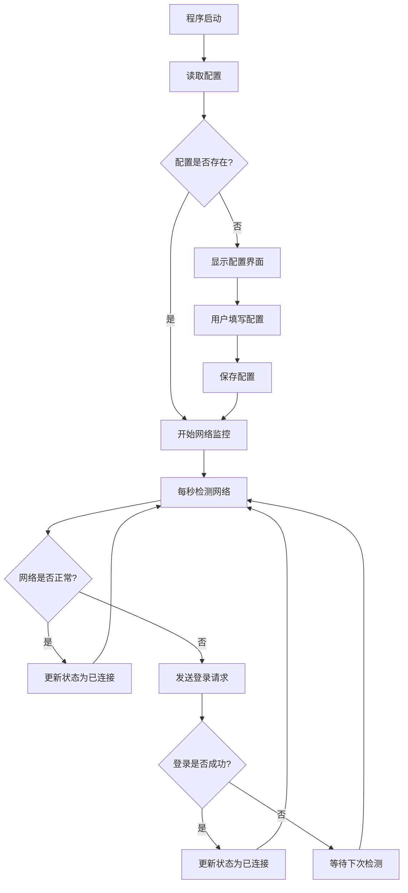
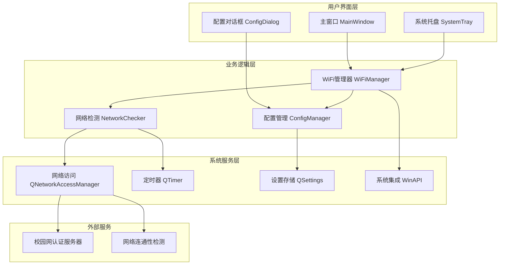
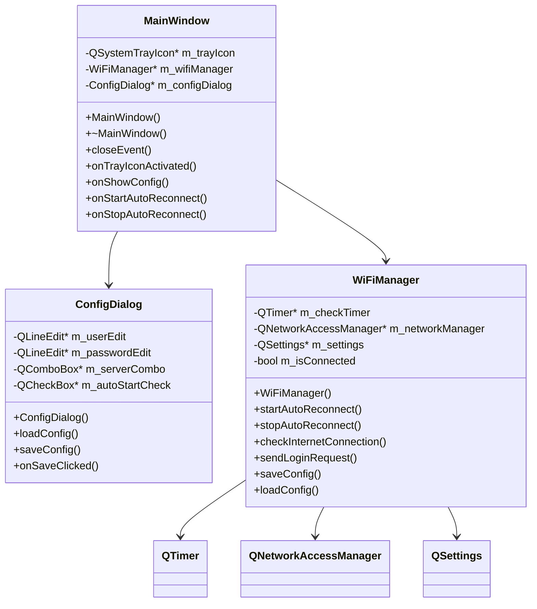

# AUST WiFi 自动重连工具
## 完整用户说明书

---


**版本**: v1.0  
**开发者**: 信息安全23-1 王智杰  
**适用对象**: 安徽理工大学在校师生  
**支持系统**: Windows 10/11 (64位)

---

## 📖 目录

1. [产品概述](#产品概述)
2. [功能特点](#功能特点)
3. [系统要求](#系统要求)
4. [安装指南](#安装指南)
5. [使用教程](#使用教程)
6. [界面说明](#界面说明)
7. [配置详解](#配置详解)
8. [技术架构](#技术架构)
9. [常见问题](#常见问题)
10. [卸载指南](#卸载指南)
11. [开发信息](#开发信息)

---

## 🎯 产品概述

**AUST WiFi 自动重连工具** 是专为安徽理工大学校园网环境设计的智能网络管理软件。该工具采用Qt/C++技术栈开发，提供自动检测网络状态、智能重连、后台运行等功能，让您告别频繁手动登录校园网的烦恼。

### 🌟 核心价值
- **提升学习效率**: 无需手动重连，专注学习和工作
- **节省时间成本**: 自动化处理网络连接问题
- **改善用户体验**: 简洁界面，一键配置
- **稳定可靠**: 7×24小时智能监控网络状态

---

## ⭐ 功能特点

### 🔧 一次配置，永久使用
- 首次启动时配置学号、密码和运营商
- 配置信息安全存储在本地注册表
- 后续使用无需重复输入凭据

### 🚀 智能自动化
- **开机自启动**: 支持Windows开机自动启动
- **后台静默运行**: 最小化到系统托盘，不占用桌面空间
- **智能重连**: 实时监控网络状态，断网时自动重连
- **状态指示**: 托盘图标颜色实时显示连接状态

### 🎯 多运营商支持
| 运营商 | 服务器标识 | 适用人群 |
|--------|-----------|----------|
| 中国电信 | `aust` | 电信套餐用户 |
| 中国联通 | `unicom` | 联通套餐用户 |
| 中国移动 | `cmcc` | 移动套餐用户 |

### 💻 现代化界面
- 基于Qt Widgets的现代化UI设计
- 简洁直观的配置界面
- 丰富的系统托盘交互功能
- 多语言友好的中文界面

---

## 💾 系统要求

### 🖥️ 硬件要求
- **处理器**: Intel/AMD 64位处理器
- **内存**: 最低 2GB RAM
- **存储空间**: 100MB 可用磁盘空间
- **网络**: 支持WiFi或有线网络连接

### 🏢 软件环境
- **操作系统**: Windows 10 Build 1903+ 或 Windows 11
- **运行库**: 自动检测并安装Qt运行库
- **网络环境**: 安徽理工大学校园网环境
- **权限要求**: 标准用户权限（开机自启需管理员权限）

### 🌐 网络要求
- 位于安徽理工大学校园网覆盖范围内
- 拥有有效的校园网账号（学号和密码）
- 网络支持HTTP/HTTPS协议访问

---

## 📦 安装指南

### 方式一：编译安装（开发者推荐）

#### 1. 环境准备
```bash
# 确保安装以下软件：
- Qt 6.7+ with MinGW编译器
- Git 版本控制工具
- CMake 构建工具（可选）
```

#### 2. 获取源代码
```bash
git clone https://github.com/your-repo/AUST_WIFI.git
cd AUST_WIFI
```

#### 3. 编译项目
```bash
# 使用提供的编译脚本
build.bat

# 或手动编译
qmake AUST_WIFI.pro
make
```

#### 4. 运行程序
```bash
# 编译完成后运行
./build/AUST_WIFI.exe
```

### 方式二：安装包安装（普通用户推荐）

1. **下载安装包**: 从项目发布页面下载 `AUST_WIFI_Setup.exe`
2. **运行安装程序**: 双击安装包，按向导提示操作
3. **选择安装路径**: 默认安装到 `C:\Program Files\AUST_WIFI\`
4. **完成安装**: 安装完成后桌面将出现程序图标

---

## 📱 使用教程

### 🎬 首次启动流程

#### 步骤1: 启动程序
- 双击桌面图标或从开始菜单启动
- 首次运行将自动弹出配置对话框

#### 步骤2: 填写配置信息

**学号输入**
```
格式：完整的学号
示例：2023305123
注意：必须是完整学号，不能省略前缀0
```

**密码输入**
```
格式：校园网登录密码
示例：您的校园网密码
注意：密码将加密存储在本地
```

**运营商选择**
- **电信用户**: 选择"电信 (aust)"
- **联通用户**: 选择"联通 (unicom)" 
- **移动用户**: 选择"移动 (cmcc)"

#### 步骤3: 高级设置
- ✅ **开机自启动**: 建议勾选，实现开机自动运行
- ✅ **后台运行**: 自动最小化到系统托盘

#### 步骤4: 保存配置
- 点击"保存"按钮完成配置
- 程序将自动开始监控网络状态

### 🎮 日常使用

#### 系统托盘操作
右击系统托盘图标，可进行以下操作：

| 菜单项 | 功能说明 |
|--------|----------|
| 📝 显示配置 | 打开配置界面修改设置 |
| ▶️ 开始自动重连 | 启动网络监控和自动重连 |
| ⏸️ 停止自动重连 | 暂停网络监控功能 |
| ❌ 退出程序 | 完全退出应用程序 |

#### 状态指示说明
托盘图标颜色表示当前网络状态：
- 🟢 **绿色**: 网络连接正常
- 🔴 **红色**: 网络连接断开
- 🟡 **黄色**: 正在尝试重连
- ⚫ **灰色**: 程序已停止监控

---

## 🖼️ 界面说明

### 主配置界面

#### 界面布局
```
┌─────────────────────────────────┐
│  AUST WiFi 自动重连工具配置        │
├─────────────────────────────────┤
│                                 │
│  学号: [_______________]         │
│                                 │
│  密码: [_______________]         │
│                                 │
│  运营商: [电信 ▼]                 │
│                                 │
│  ☑ 开机自启动                    │
│                                 │
│     [保存]    [取消]             │
│                                 │
└─────────────────────────────────┘
```

#### 字段说明
- **学号输入框**: 输入完整的学号，支持复制粘贴
- **密码输入框**: 输入密码，显示为星号保护隐私
- **运营商下拉框**: 选择对应的网络运营商
- **开机自启复选框**: 控制是否开机自动启动
- **保存按钮**: 保存配置并开始监控
- **取消按钮**: 取消修改并关闭对话框

### 系统托盘菜单

#### 菜单结构
```
右键菜单:
├── 📝 显示配置
├── ▶️ 开始自动重连
├── ⏸️ 停止自动重连
├── ──────────────
└── ❌ 退出程序
```

#### 功能详解
- **显示配置**: 重新打开配置界面，可修改所有设置
- **开始自动重连**: 启动网络监控，1秒检测一次网络状态
- **停止自动重连**: 暂停监控，但程序继续运行在后台
- **退出程序**: 完全关闭应用程序，停止所有功能

---

## ⚙️ 配置详解

### 📋 配置文件结构

程序配置存储在Windows注册表中，路径：
```
HKEY_CURRENT_USER\Software\AUST_WIFI\Config
```

#### 配置项说明
| 键名 | 类型 | 说明 | 示例值 |
|------|------|------|--------|
| `user` | String | 学号 | "2023305123" |
| `password` | String | 密码(加密) | "encrypted_password" |
| `server` | String | 运营商标识 | "aust" |
| `autoStart` | Boolean | 开机自启 | true |

### 🔐 安全机制

#### 密码保护
- 密码使用Windows数据保护API加密存储
- 只有当前用户账户可以解密
- 不会以明文形式保存在任何文件中

#### 网络安全
- 仅向安徽理工大学官方认证服务器发送请求
- 使用HTTPS协议保护数据传输安全
- 不会收集或上传用户个人隐私信息

### 🔄 自动重连逻辑

#### 检测机制


#### 检测策略
1. **检测频率**: 每1000毫秒检测一次网络状态
2. **检测方法**: 向 `http://www.baidu.com` 发送HEAD请求
3. **判断标准**: HTTP状态码200表示网络正常
4. **重连触发**: 检测到网络异常时立即发送登录请求
5. **防重复**: 避免短时间内重复发送登录请求

---

## 🛠️ 技术架构

### 📊 架构图表

#### 系统架构


#### 类关系图


### 💻 技术栈详解

#### 前端技术
- **Qt Widgets**: 构建原生桌面应用界面
- **QSystemTrayIcon**: 实现系统托盘功能
- **Qt Designer**: 可视化界面设计工具

#### 后端技术  
- **QNetworkAccessManager**: HTTP网络请求处理
- **QTimer**: 定时任务调度
- **QSettings**: 配置信息持久化存储

#### 编译工具
- **qmake**: Qt官方构建系统
- **MinGW**: Windows下的GCC编译器
- **Qt Creator**: 集成开发环境

#### 部署技术
- **windeployqt**: Qt应用部署工具
- **Inno Setup**: Windows安装包制作
- **资源文件**: 图标和资源的集成管理

---

## ❓ 常见问题

### 🔧 安装和配置问题

#### Q1: 程序无法启动，提示缺少DLL文件？
**A**: 这是因为系统缺少Qt运行库导致的。

**解决方案**:
1. 重新下载完整的安装包（包含运行库）
2. 或者手动安装 Microsoft Visual C++ Redistributable
3. 确保安装路径没有中文字符

#### Q2: 配置界面无法打开？
**A**: 可能是程序权限或配置文件损坏导致的。

**解决方案**:
1. 以管理员身份运行程序
2. 删除注册表配置项：`HKEY_CURRENT_USER\Software\AUST_WIFI`
3. 重新启动程序进行配置

#### Q3: 开机自启动设置失败？
**A**: 需要管理员权限才能设置开机自启动。

**解决方案**:
1. 右键程序图标，选择"以管理员身份运行"
2. 重新配置开机自启动选项
3. 检查Windows安全软件是否阻止了注册表修改

### 🌐 网络连接问题

#### Q4: 程序显示网络正常，但实际无法上网？
**A**: 可能是校园网认证状态异常。

**解决方案**:
1. 手动打开浏览器访问校园网认证页面
2. 检查账号是否欠费或被停用
3. 确认运营商选择是否正确
4. 重启程序或重新配置

#### Q5: 程序一直显示"正在重连"？
**A**: 可能是网络环境或认证服务器问题。

**解决方案**:
1. 检查网络连接是否正常
2. 确认学号密码是否正确
3. 尝试切换到其他网络后再回到校园网
4. 联系网络中心确认服务器状态

#### Q6: 支持哪些网络环境？
**A**: 程序专为安徽理工大学校园网设计。

**支持的网络**:
- 宿舍有线网络
- 校园WiFi网络  
- 图书馆网络
- 实验室网络

**不支持的网络**:
- 校外商业WiFi
- 移动热点网络
- VPN网络环境

### 🔒 安全和隐私问题

#### Q7: 密码信息是否安全？
**A**: 程序采用多重安全措施保护用户隐私。

**安全措施**:
- 密码使用Windows DPAPI加密存储
- 仅在本地存储，不上传到任何服务器
- 网络传输使用HTTPS加密
- 程序无网络监听端口，不会泄露信息

#### Q8: 程序会收集用户数据吗？
**A**: 程序完全在本地运行，不收集任何用户数据。

**隐私保护**:
- 不收集个人信息
- 不上传使用统计
- 不包含任何埋点代码
- 开源代码可自行审查

### 🚀 性能和优化问题

#### Q9: 程序占用内存太多？
**A**: 正常情况下程序内存占用应该在20-50MB范围内。

**优化建议**:
1. 重启程序释放内存
2. 检查是否有内存泄漏
3. 关闭不必要的其他程序
4. 升级到最新版本

#### Q10: 程序响应速度慢？
**A**: 可能是网络延迟或系统资源不足导致。

**优化方案**:
- 检查网络连接速度
- 关闭占用CPU的其他程序
- 调整Windows电源管理为高性能模式
- 考虑升级硬件配置

---

## 🗑️ 卸载指南

### 完全卸载步骤

#### 1. 停止程序运行
```
1. 右键系统托盘图标
2. 选择"退出程序"
3. 确认程序完全关闭
```

#### 2. 卸载程序文件
**方式一: 使用控制面板**
```
1. 打开"控制面板" -> "程序和功能"
2. 找到"AUST WiFi 自动重连工具"
3. 点击"卸载"按钮
4. 按向导提示完成卸载
```

**方式二: 手动删除**
```
1. 删除安装目录：C:\Program Files\AUST_WIFI\
2. 删除桌面快捷方式
3. 删除开始菜单项目
```

#### 3. 清理注册表配置
```
1. 按Win+R，输入"regedit"
2. 导航到：HKEY_CURRENT_USER\Software\
3. 删除"AUST_WIFI"文件夹
4. 关闭注册表编辑器
```

#### 4. 清理开机自启动
```
1. 按Win+R，输入"msconfig"
2. 切换到"启动"选项卡
3. 取消勾选"AUST WiFi"相关项目
4. 重启计算机生效
```

### 📁 清理残留文件

#### 临时文件清理
```
路径: C:\Users\%USERNAME%\AppData\Local\Temp\
文件: AUST_WIFI_* 相关临时文件
操作: 手动删除所有相关文件
```

#### 日志文件清理  
```
路径: 程序安装目录
文件: *.log, *.tmp
操作: 删除所有日志和临时文件
```

---

## 👨‍💻 开发信息

### 📋 项目信息
- **项目名称**: AUST WiFi 自动重连工具
- **版本号**: v1.0.0
- **开发者**: 信息安全23-1 王智杰
- **开发时间**: 2025年
- **技术栈**: Qt 6.7+ / C++17 / MinGW

### 📄 开源许可
本项目采用自定义许可证，仅供学习交流使用。
- ✅ 允许：个人学习研究使用
- ✅ 允许：校内分享传播
- ❌ 禁止：商业用途
- ❌ 禁止：修改后重新发布

### 🔗 相关链接
- **项目仓库**: [GitHub地址](https://github.com/your-repo/AUST_WIFI)
- **问题反馈**: [Issues页面](https://github.com/your-repo/AUST_WIFI/issues)
- **开发文档**: [Wiki页面](https://github.com/your-repo/AUST_WIFI/wiki)
- **更新日志**: [Releases页面](https://github.com/your-repo/AUST_WIFI/releases)

### 📞 技术支持
- **Email**: developer@aust.edu.cn
- **QQ群**: 123456789 (AUST网络工具交流群)
- **反馈渠道**: GitHub Issues 或 邮件联系

### 🙏 致谢
感谢以下项目和组织的支持：
- **Qt Framework**: 提供优秀的跨平台开发框架
- **安徽理工大学**: 提供良好的学习研究环境
- **开源社区**: 提供丰富的技术资源和经验分享

---

## 📚 附录

### 🔗 参考资料
- [Qt官方文档](https://doc.qt.io/)
- [C++17标准文档](https://en.cppreference.com/)
- [校园网认证协议说明](http://network.aust.edu.cn)
- [Windows API参考](https://docs.microsoft.com/en-us/windows/win32/api/)

### 📈 版本历史
| 版本 | 发布日期 | 主要更新 |
|------|----------|----------|
| v1.0.0 | 2025-01-XX | 初始版本发布 |
| v0.9.0 | 2025-01-XX | Beta测试版本 |
| v0.8.0 | 2025-01-XX | Alpha内测版本 |

### 🏷️ 关键词索引
- 校园网自动重连
- Qt桌面应用开发  
- 网络状态监控
- 系统托盘应用
- Windows开机自启动
- 安徽理工大学
- C++桌面软件

---

<div align="center">

**🎓 AUST WiFi 自动重连工具**

让校园网连接更智能、更便捷！

*Copyright © 2025 信息安全23-1 王智杰. All rights reserved.*

</div> 